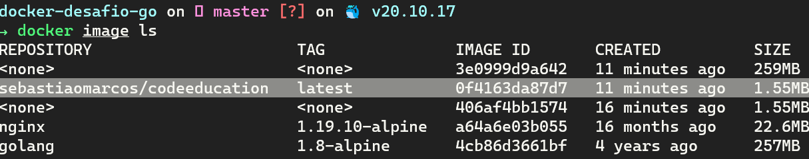
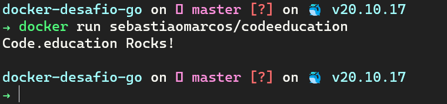

# Projeto prtático: Otimização de uma imagem golang

## Descrição do projeto 

Esse desafio é muito empolgante principalmente se você nunca trabalhou com a linguagem Go!
Você terá que publicar uma imagem no docker hub. Quando executarmos:

    -  docker run <seu-user>/codeeducation

Temos que ter o seguinte resultado: `Code.education Rocks!`

Se você perceber, essa imagem apenas realiza um print da mensagem como resultado final, logo, vale a pena dar uma conferida no próprio site da Go Lang para aprender como fazer um "olá mundo".

Lembrando que a Go Lang possui imagens oficiais prontas, vale a pena consultar o Docker Hub.

A imagem de nosso projeto Go precisa ter menos de 2MB =)

Dica: No vídeo de introdução sobre o Docker quando falamos sobre o sistema de arquivos em camadas, apresento uma imagem "raiz", talvez seja uma boa utilizá-la.

Divirta-se
###[Link da imagem go ](https://hub.docker.com/repository/docker/sebastiaomarcos/codeeducation)

## Build 

```
docker build -t sebastiaomarcos/codeeducation .
```
## Images

```
docker images
```


## Run

```
docker run sebastiaomarcos/codeeducation
```


## Docker login

```
docker login
```
## Push

```
docker push sebastiaomarcos/codeeducation
```
## Pull

```
docker pull sebastiaomarcos/codeeducation
```

## Referências
- http://goporexemplo.golangbr.org/hello-world.html
- https://hub.docker.com/_/scratch/
- https://hub.docker.com/_/golang/
